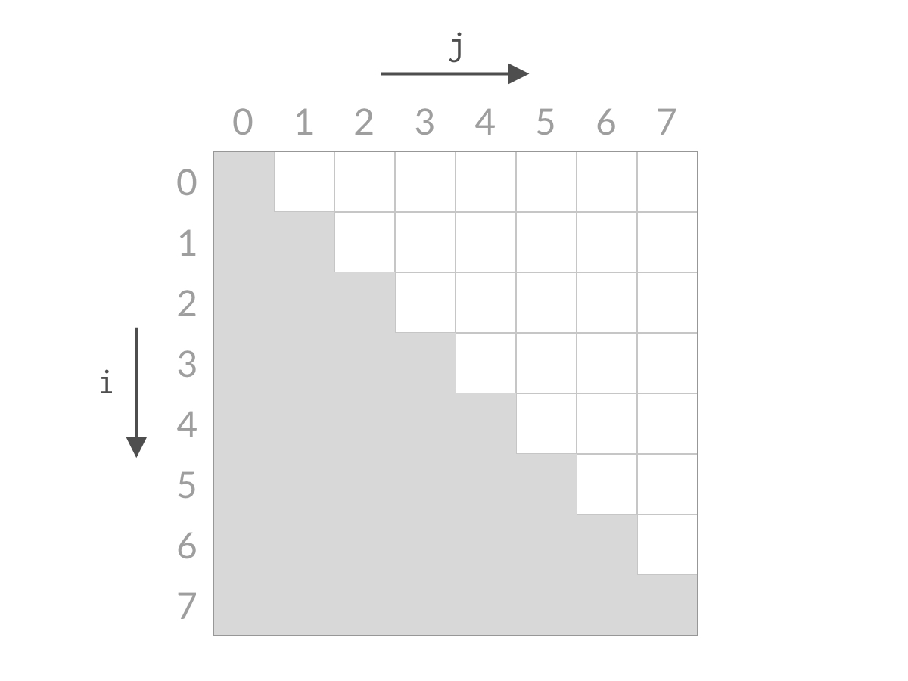

# 167. Two Sum II - Input Array Is Sorted (Medium)

<figure><figcaption></figcaption></figure>

<figure><figcaption></figcaption></figure>


### 题目要求只能使用O(1) space，因此不能用HashMap来解；那就Two Pointers吧：）

### Two Pointers 解法的本质原理 - 缩减搜索空间

1. 在这道题中，我们的目标是要找到符合条件的一对下标（i，j），约束条件是：
   * i、j要合法，即 0 <= i < n, 0 <= j < n;
   * i < j （题目要求）

<figure><figcaption></figcaption></figure>

因为i < j，所以符合条件的是白色格子的部分，如果一个格子一个格子排除，那就是O(N^2)数量级的，如果要做到O(N)数量级的，我们必须一次排除多个格子（缩减搜索空间）；

例子：

<figure><figcaption></figcaption></figure>

我们计算A\[0]+A\[7]是大于target还是小于target，假设 A\[0]+A\[7] < target，则我们应该去找sum更大的两个数，因为array是sorted的，所以A\[7]是最大的数了，其他的数跟A\[0]相加只会更小，则A\[0] + A\[6]、A\[0] + A\[5]、A\[0] + A\[4]...都小于target，可以排除，相当于i = 0的情况一次性都可以被排除。对应用双指针解法的代码，就是 i++，对应于搜索空间，就是排除了一整行的搜索空间：

<figure><figcaption></figcaption></figure>

可以看到，无论 A\[i] + A\[j] 的结果是大了还是小了，我们都可以排除掉一行或者一列的搜索空间。经过 n步以后，就能排除所有的搜索空间，检查完所有的可能性。搜索空间的减小过程如下面动图所示：


<figure><figcaption></figcaption></figure>

题目要求我们O(1) space：）所以hashmap用不了了orz

```java
public int[] twoSum(int[] numbers, int target) {
        // Solution 1: O(N) time, O(N) space
        // Map<Integer, Integer> map = new HashMap<>();
        // int[] result = new int[2];
        // for (int i = 0; i < numbers.length; i++) {
        //     if (map.containsKey(target - numbers[i])) {
        //         result[1] = i + 1;
        //         result[0] = map.get(target - numbers[i]);
        //         return result;
        //     }
        //     map.put(numbers[i], i + 1);
        // }
        // return result;


        // Solution 2: two pointers - O(N) time, O(1) space
        int i = 0;
        int j = numbers.length - 1;

        while (i < j && numbers[i] + numbers[j] != target) {
            int sum = numbers[i] + numbers[j];
            if (sum < target) {
                i++;
            } else if (sum > target) {
                j--;
            }
        }
        return new int[]{i + 1, j + 1};
    }
```
