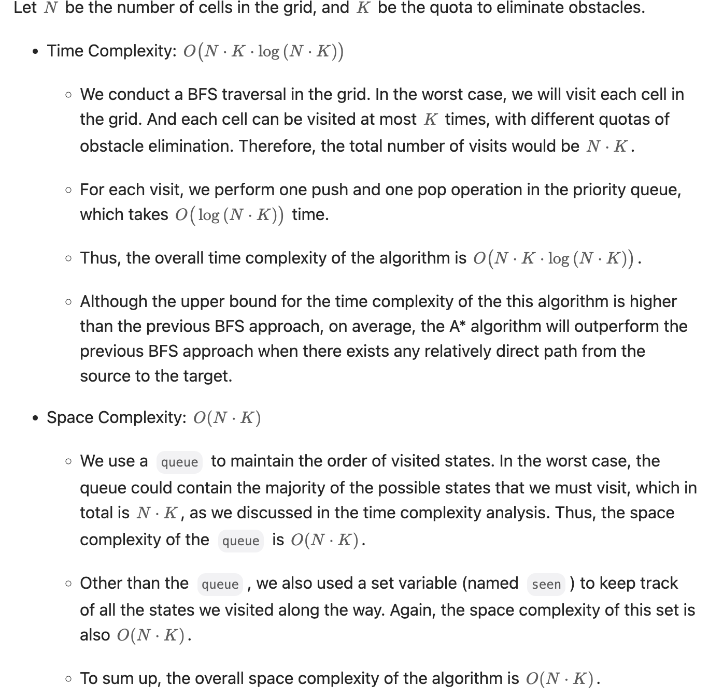

# 20. Valid Parentheses (Easy)

<figure><figcaption></figcaption></figure>

### 如果只有一种括号：

```java
/**
* 一个字符串合法括号字符串的条件:
* 1. 左右括号数量相等;
* 2. 任意一个位置左括号的数量都大于等于右括号的数量。
*/

boolean isValid(String str) {
    // 待匹配的左括号数量
    int left = 0;
    for (int i = 0; i < str.length(); i++) {
        if (str.charAt(i) == '(') {
            left++;
        } else {
            // 遇到右括号
            left--;
        }

        // 右括号太多
        if (left == -1)
            return false;
    }
    // 是否所有的左括号都被匹配了
    return left == 0;
}

```

<figure><figcaption></figcaption></figure>

### Approach 1: using Stack

**遇到左括号就入栈，遇到右括号就去栈中寻找最近的左括号，看是否匹配：**

````java
```java
class Solution {
    public boolean isValid(String s) {
        Stack<Character> stack = new Stack<>();
        for (char c: s.toCharArray()) {
            if (c == '(' || c == '{' || c == '[') { // c is one of the open brackets
                stack.push(c);
            } else if (!stack.isEmpty() && stack.peek() == pairs(c)) { // c is one of the close brackets
                stack.pop();
            } else {
                return false;
            }
        }
        return stack.isEmpty(); // check if all of the parentheses are paired
    }

    private char pairs(char c) {
        if (c == ')') return '(';
        else if (c == ']') return '[';
        else return '{';
    }
}
```
````

### Complexity Analysis:

* Time complexity: $$O(N)$$
* Space complexity: $$O(N)$$
