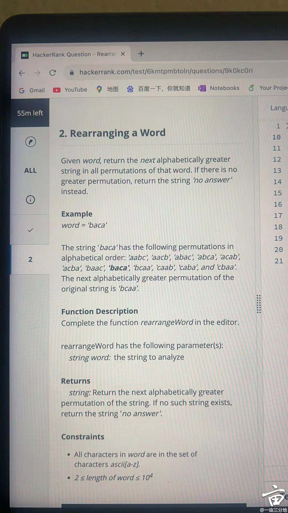
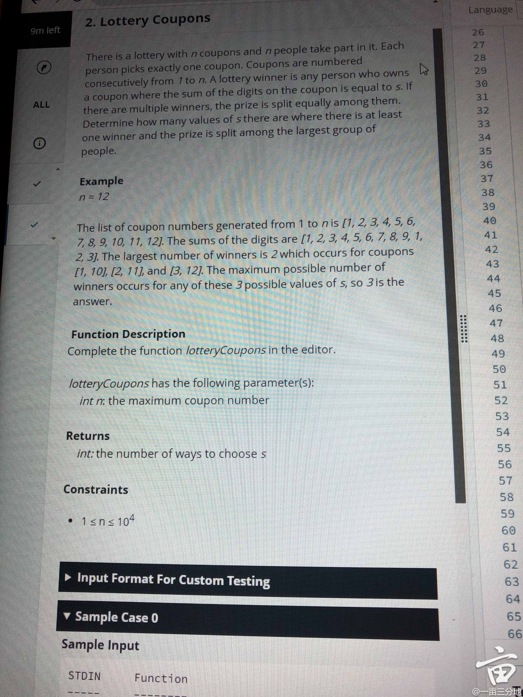
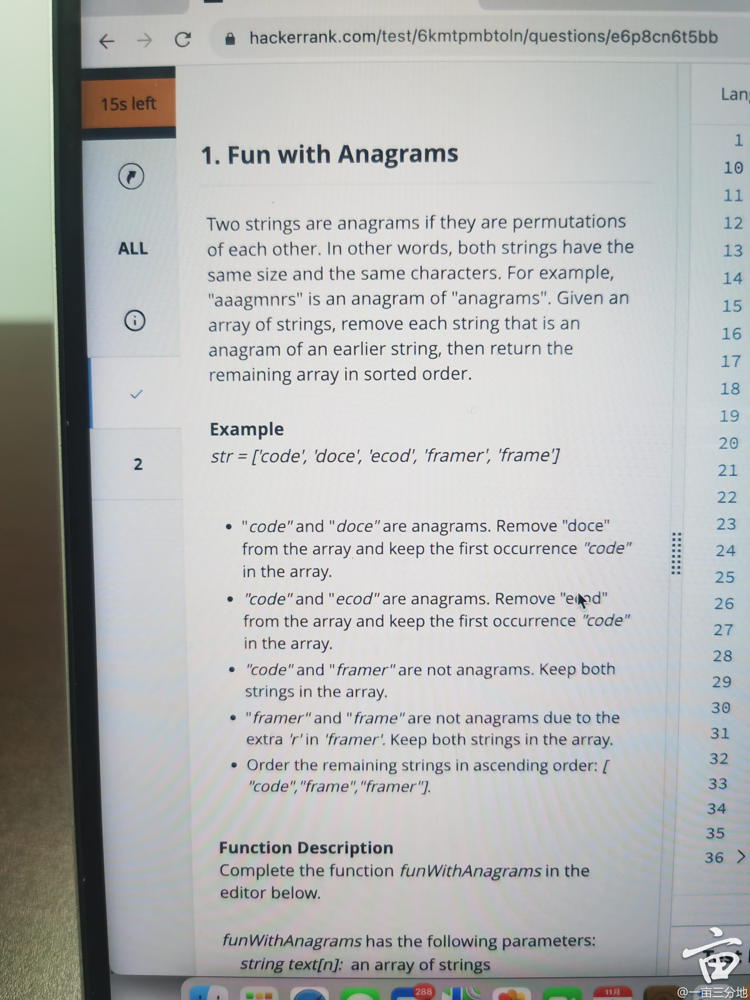
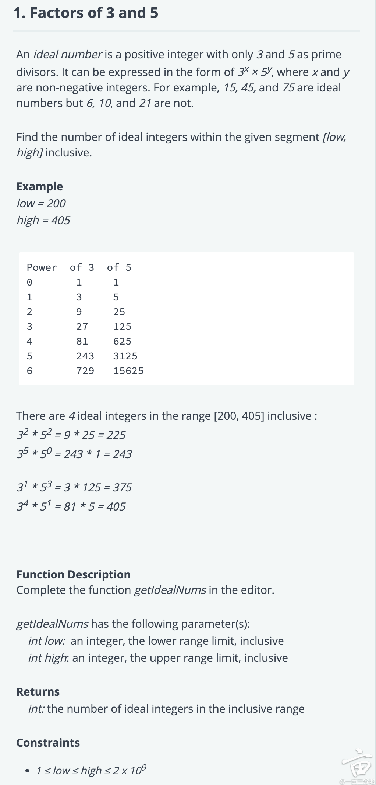
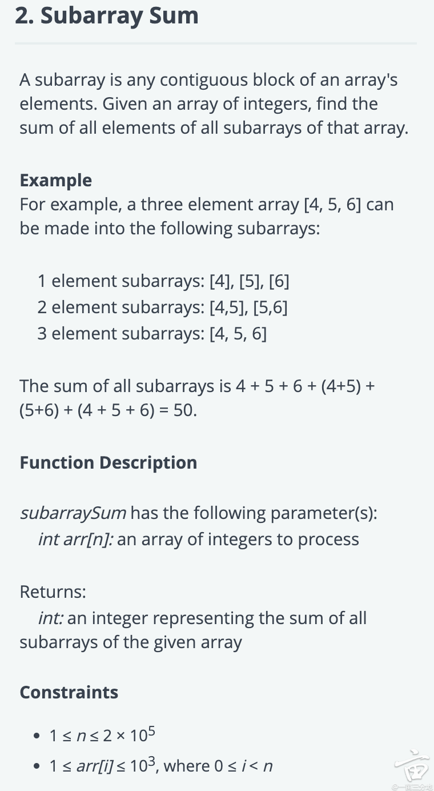
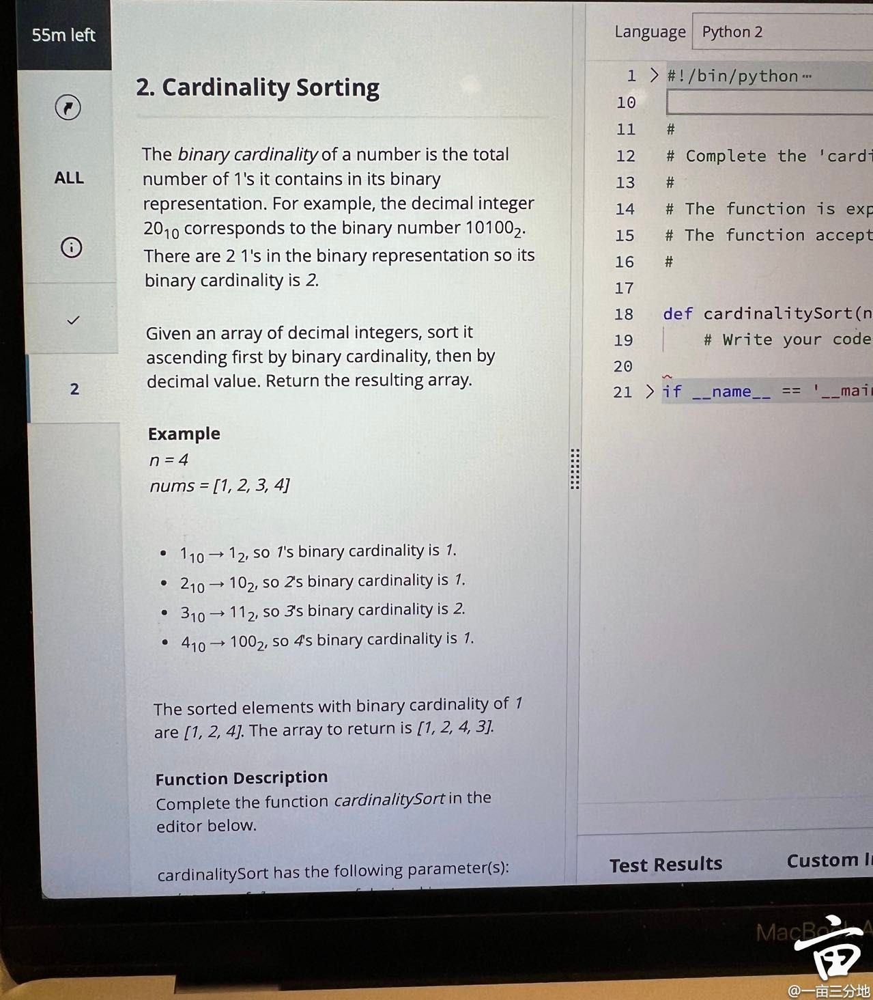
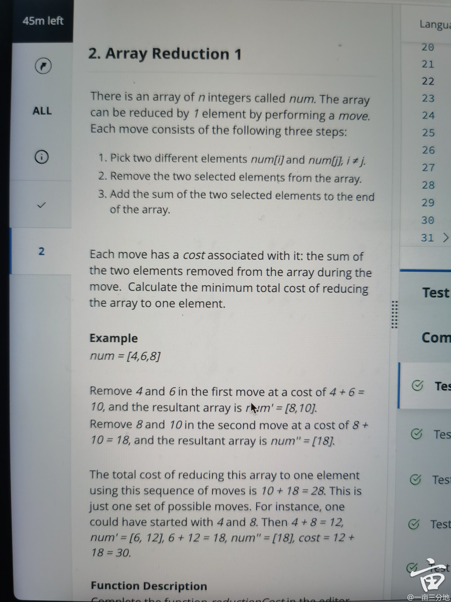

# JP Morgan OA

<figure><figcaption></figcaption></figure>


````java
To improve the time complexity of the function for finding highly profitable intervals, we can avoid checking every possible subarray of length `k`. Instead, we can iterate through the array once and keep track of the length of the current increasing sequence.

Here's an improved Java method that reduces the time complexity:

```java
public int countHighlyProfitableIntervals(int[] stockPrices, int k) {
    if (k == 1) return stockPrices.length; // Every single month is a profitable interval in itself.
    
    int count = 0;
    int lengthOfIncreasing = 1; // Start with a sequence of length 1 (a single month).

    for (int i = 1; i < stockPrices.length; i++) {
        if (stockPrices[i] > stockPrices[i - 1]) {
            lengthOfIncreasing++; // Extend the sequence.
            if (lengthOfIncreasing >= k) {
                count++; // Found a profitable interval of length k.
            }
        } else {
            lengthOfIncreasing = 1; // Reset the sequence if it's not increasing.
        }
    }
    return count;
}
```

With this approach, the time complexity is reduced to `O(n)`, where `n` is the length of the `stockPrices` array. This is because the algorithm now goes through the array only once, incrementing the count of profitable intervals each time an interval of length `k` is found within a longer increasing sequence.
````


<figure><figcaption></figcaption></figure>

1. **Identify Pivot:**
   * Start from the end of the string and move backwards to find the first character that is smaller than the character immediately after it. This character is referred to as the 'pivot'.
   * If no such pivot is found, it means the entire string is in descending order, it means we are at the last permutation, so return "no answer".
2. **Find the Ceiling of the Pivot:**
   * From the end of the string, **find the smallest character that is larger than the pivot**. This character will be the 'ceiling' of the pivot.
   * The purpose of finding the ceiling is to ensure that when we swap it with the pivot, we get the next greater permutation.
3. **Swap the Pivot and Ceiling:**
   * Swap the pivot with the found ceiling character. This swap will place the next higher character in the pivot's position, ensuring that the new string is greater than the original.
4. **Reverse the Suffix:**
   * After the swap, reverse the substring that comes after the original position of the pivot.
   * The reason for the <mark style="color:red;">**reversal**</mark> is that once the pivot has been swapped with the ceiling, the suffix (the part of the string after the pivot) is still in descending order. We want the smallest permutation that is larger than the original, so we reverse this suffix to convert it into ascending order.
   * <mark style="color:red;">**Why swapping the suffix?**</mark>&#x20;
     * For example, the next permutation for "bcaa" is " caab". Before the swap, all characters to the right of the pivot 'b' were in descending order ('caa'). This is because we initially chose 'b' as the pivot since it was the first character from the end that was less than its following character ('c'). Everything after 'b' was already in descending order, which is why 'b' was the pivot.
     * Reverse the Suffix:We swapped 'b' and 'c', but the 'aa' after 'c' is still in descending order (though 'aa' is the same either way). Normally, if the characters were distinct and in descending order, reversing them would change the order to **ascending, which is the lowest possible order for that set of characters.** We want the next permutation to be the smallest increase in order from the current permutation. If we didn't reverse, the characters after the pivot would remain in descending order, making the permutation larger than necessary.I
     * n the case of "bcaa", reversing "aa" doesn't change it because it consists of repeating characters. However, if there were distinct characters, like "bcda", after swapping we would have "cdba", and we'd need to reverse "dba" to "abd" to ensure we have the next smallest permutation ("cabd").


````java
```java
public class NextPermutation {

    public static String rearrangeWord(String word) {
        char[] characters = word.toCharArray();
        int i = characters.length - 2;
        // Step 1: find the first character that is not following the descending order
        while (i >= 0 && characters[i] >= characters[i + 1]) {
            i--;
        }
        
        // If no such character is found, return "no answer"
        if (i < 0) {
            return "no answer";
        }
        
        // Step 3: find the ceiling of `characters[i]`
        int j = characters.length - 1;
        while (characters[j] <= characters[i]) {
            j--;
        }
        
        // Step 4: swap the two characters
        swap(characters, i, j);
        
        // Step 5: reverse the substring after the original character's position
        reverse(characters, i + 1, characters.length - 1);
        
        return new String(characters);
    }
    
    private static void swap(char[] characters, int i, int j) {
        char temp = characters[i];
        characters[i] = characters[j];
        characters[j] = temp;
    }
    
    private static void reverse(char[] characters, int start, int end) {
        while (start < end) {
            swap(characters, start, end);
            start++;
            end--;
        }
    }
    
    public static void main(String[] args) {
        String word = "baca";
        System.out.println(rearrangeWord(word));
    }
}
```
````



<figure><figcaption></figcaption></figure>


````java
This function calculates the sum of digits for all numbers from 1 to \( n \) and counts how many times each sum occurs. It then determines the maximum occurrence to find the number of ways to choose \( s \).

```java
public class LotteryCoupons {
    public static int lotteryCoupons(int n) {
        int[] sumOccurrences = new int[28]; // Since the maximum sum of digits for 10^4 is 9+9+9+9 = 36
        for (int i = 1; i <= n; i++) {
            int sum = sumOfDigits(i);
            sumOccurrences[sum]++;
        }

        int maxOccurrence = 0;
        int numberOfWays = 0;
        for (int occurrence : sumOccurrences) {
            if (occurrence > maxOccurrence) {
                maxOccurrence = occurrence;
                numberOfWays = 1;
            } else if (occurrence == maxOccurrence) {
                numberOfWays++;
            }
        }

        return numberOfWays;
    }

    private static int sumOfDigits(int number) {
        int sum = 0;
        while (number > 0) {
            sum += number % 10;
            number /= 10;
        }
        return sum;
    }

    public static void main(String[] args) {
        int n = 12; // Example input
        System.out.println("Number of ways to choose s: " + lotteryCoupons(n));
    }
}
```
````



<figure><figcaption></figcaption></figure>


````java
```java
import java.util.Arrays;
import java.util.LinkedHashSet;
import java.util.Set;

public class FunWithAnagrams {

    public static String[] funWithAnagrams(String[] text) {
        Set<String> uniqueSortedStrings = new LinkedHashSet<>();

        for (String str : text) {
            String sortedStr = sortString(str);
            if (!uniqueSortedStrings.contains(sortedStr)) {
                uniqueSortedStrings.add(sortedStr);
            }
        }

        return uniqueSortedStrings.toArray(new String[0]);
    }

    private static String sortString(String str) {
        char[] charArray = str.toCharArray();
        Arrays.sort(charArray);
        return new String(charArray);
    }

    public static void main(String[] args) {
        String[] input = {"code", "doce", "ecod", "framer", "frame"};
        String[] result = funWithAnagrams(input);
        Arrays.sort(result); // Sort the result to return strings in ascending order
        System.out.println(Arrays.toString(result));
    }
}
```
````



````java
Without sorting each word by using a frequency map (a map that counts the occurrence of each letter)

```java
import java.util.*;

public class FunWithAnagrams {

    public static List<String> funWithAnagrams(String[] text) {
        Map<String, String> map = new HashMap<>();
        for (String str : text) {
            String key = getKey(str);
            if (!map.containsKey(key)) {
                map.put(key, str);
            }
        }
        List<String> result = new ArrayList<>(map.values());
        Collections.sort(result);
        return result;
    }

    private static String getKey(String str) {
        int[] frequency = new int[26]; // Assuming 'str' only contains lowercase letters a-z
        for (char c : str.toCharArray()) {
            frequency[c - 'a']++;
        }
        return Arrays.toString(frequency);
    }

    public static void main(String[] args) {
        String[] input = {"code", "doce", "ecod", "framer", "frame"};
        List<String> result = funWithAnagrams(input);
        System.out.println(result); // Output: [code, frame, framer]
    }
}
```

In this implementation:

- The `getKey` method creates a frequency map for each word, which is a string representation of a 26-length array (for each letter of the English alphabet). This string will be the same for anagrams.
- We then use this key to determine if we've already seen an anagram of the current word. If not, we put the original word in the map.
- After processing all words, we get the values from the map, sort them, and return the sorted list.

This way, we avoid sorting individual strings and instead use a frequency map to check for anagrams.
````


<figure><figcaption></figcaption></figure>


````java
For the **Factors of 3 and 5** problem, the goal is to count the numbers in the given range that are of the form `3^x * 5^y`. We can do this by iterating through the powers of 3 and 5 within the range:

```java
public class IdealNumbers {
    public static int getIdealNums(int low, int high) {
        int count = 0;
        for (long i = 1; i <= high; i *= 3) {
            for (long j = 1; i * j <= high; j *= 5) {
                if (i * j >= low) {
                    count++;
                }
            }
        }
        return count;
    }

    public static void main(String[] args) {
        int low = 200; // Example
        int high = 405; // Example
        System.out.println(getIdealNums(low, high)); // Output: 4
    }
}
```

These are the Java solutions for both problems. Note that in the Subarray Sum problem, we use a `long` type for the total sum to prevent integer overflow for large inputs.
````



<figure><figcaption></figcaption></figure>


````java
Certainly! Let's solve both problems one by one in Java.

For the **Subarray Sum** problem, a brute-force approach would involve generating all subarrays and summing their elements, but that would be inefficient for large arrays. Instead, we can use a formula based on the observation that an element at index `i` contributes to `(i + 1) * (n - i)` subarrays:

1. Starting Points:
For an element at index `i`:
- It can be the start of a subarray (which includes just this single element).
- It can also be part of a subarray that starts from any of the previous indices `0` to `i-1`.

So, the total number of subarrays starting at indices `0` to `i` that include the element at index `i` is `i + 1`. This is because you count all indices from `0` to `i`, inclusive, which is `i + 1` different starting points.

2. **Ending Points:** The same element can be the endpoint of a subarray that ends anywhere from the element itself to the end of the array. There are `n - i` such possible ending points.

- If you consider the element at index `i`, the simplest subarray including this element is the one that starts and ends at `i` (just the element itself).
- But this element can also be part of larger subarrays that extend beyond it, up to the end of the array. 

So, for an array of length `n`, and an element at index `i`:
- It can be the end of a subarray starting from `i` and ending at `i`.
- It can also be part of subarrays that end at index `i+1`, `i+2`, and so on, up to `n-1`.

Therefore, the total number of subarrays ending at indices `i` to `n-1` that include the element at index `i` is `n - i`. This counts all possible ending points from the element's position to the end of the array.

3. **Combination of Starting and Ending Points:** 

Since a subarray is uniquely identified by where it starts and where it ends, every possible starting point can be paired with every possible ending point to form a distinct subarray.

This is the "combination" part—it's about pairing each starting point with each ending point. To give you a concrete example, if you have an array of length 4 (`n = 4`) and you're looking at the element at index 1 (`i = 1`), there are 2 starting points (`0` and `1`) and 3 ending points (`1`, `2`, and `3`). So the element at index 1 contributes to \( 2 \times 3 = 6 \) subarrays:

- Starting at 0, ending at 1: `[arr[0], arr[1]]`
- Starting at 0, ending at 2: `[arr[0], arr[1], arr[2]]`
- Starting at 0, ending at 3: `[arr[0], arr[1], arr[2], arr[3]]`
- Starting at 1, ending at 1: `[arr[1]]`
- Starting at 1, ending at 2: `[arr[1], arr[2]]`
- Starting at 1, ending at 3: `[arr[1], arr[2], arr[3]]`

Each of these is a unique subarray that includes the element at index 1.

- Each of the `i + 1` starting points can pair with any of the `n - i` ending points to form a subarray.
- This forms a total of `(i + 1) * (n - i)` unique pairs or subarrays that include the element at index `i`.

By calculating this for each element and summing, you get the total of all elements across all subarrays.

```java
public class SubarraySum {
    public static long subarraySum(int[] arr) {
        long total = 0;
        int n = arr.length;
        for (int i = 0; i < n; i++) {
            total += (long) arr[i] * (i + 1) * (n - i);
        }
        return total;
    }

    public static void main(String[] args) {
        int[] arr = {4, 5, 6}; // Example
        System.out.println(subarraySum(arr)); // Output: 50
    }
}
```
````



<figure><figcaption></figcaption></figure>


````java
```java
import java.util.Arrays;
import java.util.Comparator;

public class CardinalitySorting {
    public static int[] cardinalitySort(int[] nums) {
        Arrays.sort(nums, (a, b) -> {
            int cardinalityA = binaryCardinality(a);
            int cardinalityB = binaryCardinality(b);
            
            if (cardinalityA != cardinalityB) {
                return cardinalityA - cardinalityB;
            } else {
                return a - b; // If cardinalities are equal, sort by value
            }
        });
        return nums;
                
        // OR using built in functions
        return Arrays.stream(nums)
                .boxed()
                .sorted(Comparator
                        .comparingInt((Integer i) -> Integer.bitCount(i)) // Compare by binary cardinality
                        .thenComparingInt(i -> i)) // Then compare by number itself
                .mapToInt(i -> i)
                .toArray();
    }

    // Custom method to calculate the binary cardinality
    private static int binaryCardinality(int number) {
        int count = 0;
        while (number > 0) {
            count += number & 1; // Increment count if the LSB is 1
            number >>>= 1; // Unsigned right shift
        }
        return count;
    }

    public static void main(String[] args) {
        int[] nums = {1, 2, 3, 4};
        int[] sortedNums = cardinalitySort(nums);
        System.out.println(Arrays.toString(sortedNums)); // Should output [1, 2, 4, 3]
    }
}
```
````


<figure><figcaption></figcaption></figure>


````java
This array reduction problem can be solved using a greedy approach. In each step, we want to pick the two smallest numbers to combine because this will result in the smallest possible increase in the sum for the next steps. This approach can be implemented using a priority queue that automatically sorts the numbers, allowing us to easily pick the two smallest numbers each time.

```java
import java.util.PriorityQueue;
public class ArrayReduction {

    public static int reduceArray(int[] num) {
        PriorityQueue<Integer> minHeap = new PriorityQueue<>();
        
        // Add all numbers to the min heap
        for (int n : num) {
            minHeap.add(n);
        }

        int totalCost = 0;
        
        // Continue combining the two smallest elements until only one remains
        while (minHeap.size() > 1) {
            int sum = minHeap.poll() + minHeap.poll();
            totalCost += sum;
            minHeap.add(sum);
        }

        return totalCost;
    }

    public static void main(String[] args) {
        int[] num = {4, 6, 8};
        System.out.println(reduceArray(num)); // Output: 30
    }
}
```
````

